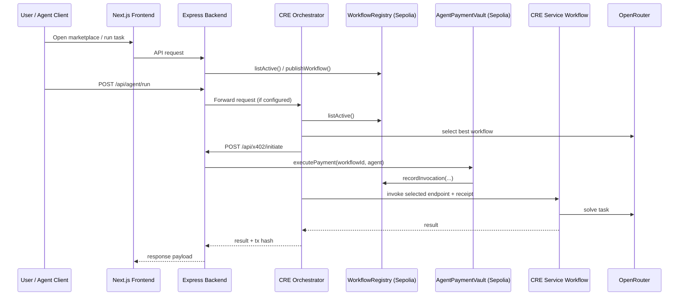

# AgentMarket

Decentralized marketplace for AI agent services using Chainlink CRE workflows, an on-chain workflow registry, and x402-style micropayment execution through a payment vault.

## Table of Contents

- [What is AgentMarket?](#what-is-agentmarket)
- [Architecture](#architecture)
- [Repository Structure](#repository-structure)
- [Tech Stack](#tech-stack)
- [How the End-to-End Flow Works](#how-the-end-to-end-flow-works)
- [Prerequisites](#prerequisites)
- [Configuration](#configuration)
- [Quick Start (Local Demo)](#quick-start-local-demo)
- [On-Chain Deployment & Seeding](#on-chain-deployment--seeding)
- [Running the CRE Workflows](#running-the-cre-workflows)
- [Frontend Usage Guide](#frontend-usage-guide)
- [Backend API Reference](#backend-api-reference)
- [Smart Contracts](#smart-contracts)
- [Development Commands](#development-commands)
- [Troubleshooting](#troubleshooting)
- [Security Notes](#security-notes)
- [Roadmap Ideas](#roadmap-ideas)

## What is AgentMarket?

AgentMarket enables an autonomous buyer agent to:

1. Discover available services (workflows) from an on-chain registry
2. Select one service based on task + budget using an LLM
3. Execute a payment through a vault contract
4. Call the selected service endpoint with payment proof
5. Return final response back to the caller

Core idea: programmable service discovery + programmable payment + verifiable on-chain accounting.

## Architecture



## Repository Structure

```text
.
├── contracts/                 # Solidity contracts
│   ├── WorkflowRegistry.sol
│   └── AgentPaymentVault.sol
├── scripts/                   # Hardhat scripts for deploy/seed
│   ├── deploy.ts
│   └── seed-registry.ts
├── backend/                   # Express API (registry, x402, agent)
│   └── src/routes/
├── frontend/                  # Next.js 15 marketplace UI
│   └── app/
└── cre-workflows/             # Chainlink CRE workflows
        ├── orchestrator/
        ├── example-service/
        └── test-workflow/
```

## Tech Stack

- **Contracts**: Solidity 0.8.24, OpenZeppelin v5, Hardhat
- **Backend**: Node.js, TypeScript, Express, ethers v6
- **Frontend**: Next.js 15, React 19, Tailwind CSS, wagmi/viem
- **Workflow Runtime**: Chainlink CRE SDK (`@chainlink/cre-sdk`)
- **LLM Provider**: OpenRouter (Gemini model configured in workflows)
- **Network**: Ethereum Sepolia

## How the End-to-End Flow Works

### 1) Publisher lists a workflow

- Frontend calls `POST /api/registry/publish`
- Backend calls `WorkflowRegistry.publishWorkflow(...)`
- Contract emits `WorkflowPublished`

### 2) Buyer runs an agent task

- Frontend posts to `POST /api/agent/run`
- If `CRE_ORCHESTRATOR_URL` is set: backend forwards request to orchestrator
- If not set: backend returns simulation response

### 3) Orchestrator discovers and selects workflow

- Reads active workflows on-chain via `EVMClient`
- Filters by `maxBudgetUSDC`
- Uses LLM to choose `selectedId`

### 4) Payment execution

- Orchestrator calls backend `POST /api/x402/initiate`
- Backend signer invokes `AgentPaymentVault.executePayment`
- Vault transfers USDC and calls `recordInvocation` in registry

### 5) Service invocation

- Orchestrator invokes selected endpoint with `X-Payment-Receipt`
- Service workflow processes task and returns answer payload

## Prerequisites

- Node.js 20+
- npm 10+
- Git
- Wallet/private key for Sepolia deployment
- Sepolia ETH for gas
- Sepolia USDC (for deposit/payment testing)
- Chainlink CRE CLI (`cre`)

Install CRE CLI (see official docs for latest installer):

```bash
curl -sSL https://cre.chain.link/install.sh | bash
```

## Configuration

Create a root `.env` file (do not commit real secrets):

```env
# Wallet / chain
PRIVATE_KEY=0x...
OWNER_ADDRESS=0x...
SEPOLIA_RPC_URL=https://eth-sepolia.g.alchemy.com/v2/...
ETHERSCAN_API_KEY=...
USDC_SEPOLIA=0x1c7D4B196Cb0C7B01d743Fbc6116a902379C7238

# Contract addresses (fill after deploy)
WORKFLOW_REGISTRY_ADDRESS=0x...
AGENT_PAYMENT_VAULT_ADDRESS=0x...

# Backend/frontend wiring
BACKEND_URL=http://localhost:3001
CRE_ORCHESTRATOR_URL=
NEXT_PUBLIC_BACKEND_URL=http://localhost:3001
NEXT_PUBLIC_REGISTRY_ADDRESS=0x...
NEXT_PUBLIC_CHAIN_ID=11155111

# Model provider
OPENROUTER_API_KEY=sk-or-...
GEMINI_API_KEY=...
```

Also mirror required runtime values into package-level env files used by each app process:

- `backend/.env` (for Express server)
- `frontend/.env.local` (for Next.js, especially `NEXT_PUBLIC_*` values)
- `cre-workflows/.env` (for workflow simulation/deploy scripts)

### CRE workflow config files

`cre-workflows/` uses:

- `cre.yaml`
- `project.yaml`
- `secrets.yaml`
- per-workflow `workflow.yaml` + `workflow.ts`

Ensure owner address, RPC URL, and secret mappings are aligned with your environment before simulation/deployment.

## Quick Start (Local Demo)

This path gives you a full UI + backend + contract interactions locally, with simulation fallback if orchestrator URL is not set.

### 1) Install dependencies

```bash
# root (hardhat + scripts)
npm install

# backend
cd backend && npm install

# frontend
cd ../frontend && npm install

# cre workflows
cd ../cre-workflows && npm install
```

### 2) Compile contracts

```bash
cd ..
npm run compile
```

### 3) Start backend

```bash
cd backend
npm run dev
```

Backend runs on `http://localhost:3001` by default.

### 4) Start frontend

```bash
cd ../frontend
npm run dev
```

Frontend runs on `http://localhost:3000`.

### 5) Test UI

- Open marketplace (`/`)
- Connect wallet (Sepolia)
- Publish a workflow (`/publish`)
- Run agent task (`/agent`)

If `CRE_ORCHESTRATOR_URL` is unset, `/api/agent/run` returns simulation output so UI flow still works.

## On-Chain Deployment & Seeding

### Deploy contracts

From repository root:

```bash
npm run deploy
```

Script actions:

1. Deploys `WorkflowRegistry`
2. Deploys `AgentPaymentVault` with `USDC_SEPOLIA` + registry address
3. Sets registry payment vault
4. Sets vault CRE relayer to deployer
5. Writes `deployments.json`

### Seed sample workflows

```bash
npm run seed
```

This publishes sample rows in `scripts/seed-registry.ts` to your deployed registry.

## Running the CRE Workflows

From `cre-workflows/`:

### Simulate orchestrator

```bash
npm run simulate:orchestrator
```

### Simulate example service

```bash
npm run simulate:service
```

### Deploy all workflows

```bash
cre login
npm run deploy:all
```

### Workflow responsibilities

- **orchestrator/workflow.ts**
    - Reads on-chain registry
    - Uses LLM to select best workflow within budget
    - Initiates payment via backend x402 endpoint
    - Invokes selected workflow endpoint

- **example-service/workflow.ts**
    - Accepts task input (+ optional payment receipt header)
    - Uses confidential HTTP call to LLM provider
    - Returns generated answer payload

## Frontend Usage Guide

### Marketplace page (`/`)

- Reads from `GET /api/registry`
- Shows workflow metadata (price, reputation, invocations)

### Publish page (`/publish`)

- Requires connected wallet
- Sends `name`, `description`, `endpoint`, `priceUSDC`
- Displays tx hash and workflow ID on success

### Agent page (`/agent`)

- Fetches balance from `/api/x402/balance/:agentAddress`
- Sends task + max budget to `/api/agent/run`
- Displays selected workflow, quality score, cost, and result

## Backend API Reference

Base URL: `http://localhost:3001`

### Registry APIs

- `GET /api/registry`
    - Returns all active workflows from contract

- `GET /api/registry/:id`
    - Returns single workflow by ID

- `POST /api/registry/publish`
    - Body:
        ```json
        {
            "name": "DeFi Yield Summarizer",
            "description": "Fetches APYs",
            "endpoint": "http://localhost:3001/api/agent/cre-service-mock",
            "priceUSDC": 0.01
        }
        ```

### x402 APIs

- `GET /api/x402/balance/:agentAddress`
    - Reads vault deposit balance for address

- `POST /api/x402/initiate`
    - Body:
        ```json
        {
            "workflowId": "0x...",
            "agentAddress": "0x..."
        }
        ```
    - Executes `executePayment` as backend signer/relayer

### Agent APIs

- `POST /api/agent/run`
    - Body:
        ```json
        {
            "task": "Find top DeFi opportunities",
            "agentAddress": "0x...",
            "maxBudgetUSDC": 0.05
        }
        ```
    - Forwards to orchestrator if configured, else simulation payload

- `POST /api/agent/log-invocation`
    - In-memory invocation logging

- `GET /api/agent/history`
    - Returns latest in-memory invocation logs

- `POST /api/agent/cre-service-mock`
    - Mock service endpoint that requires `x-payment-receipt` header

## Smart Contracts

### `WorkflowRegistry.sol`

- Publishes workflow metadata with unique workflow ID
- Stores owner, endpoint, price, reputation, invocation count
- Lists active workflows
- Accepts invocation recording only from configured payment vault

### `AgentPaymentVault.sol`

- Stores user deposits in USDC
- Allows deposit and withdrawal
- Restricts payment execution to `creRelayer`
- Deducts workflow price from agent deposit
- Transfers owner payout + protocol fee (2% to contract owner)
- Calls registry `recordInvocation(workflowId, true)`

## Development Commands

### Root

```bash
npm run compile   # hardhat compile
npm run test      # hardhat test
npm run deploy    # deploy to sepolia
npm run seed      # seed registry entries
```

### Backend

```bash
cd backend
npm run dev
npm run build
npm run start
```

### Frontend

```bash
cd frontend
npm run dev
npm run build
npm run start
npm run lint
```

### CRE workflows

```bash
cd cre-workflows
npm run build
npm run simulate:orchestrator
npm run simulate:service
npm run deploy:all
```

## Troubleshooting

### `No affordable workflows found in the Sepolia Registry`

- Increase `maxBudgetUSDC`
- Seed/publish workflows with lower price
- Verify registry address points to populated contract

### `Insufficient deposit` during payment

- Deposit USDC into vault for `agentAddress`
- Confirm `workflow.priceUSDC` and deposit units (micro-USDC) are correct
- For local demo, owner address may receive a dummy tx hash in demo-mode path

### CORS or frontend API errors

- Check backend is running on `:3001`
- Set `FRONTEND_URL` in backend environment if not using `http://localhost:3000`
- Verify `NEXT_PUBLIC_BACKEND_URL` in frontend environment

### CRE simulation issues

- Ensure `cre` CLI is installed and authenticated
- Verify `OPENROUTER_API_KEY`/secret mapping
- Confirm workflow YAML paths and target IDs are valid

## Security Notes

- Never commit real private keys or API keys.
- Rotate any secrets that were ever committed to source control.
- Restrict backend signer privileges and separate hot/cold wallets.
- Add request authentication and rate limiting to backend routes before production.
- Validate workflow endpoints and add allowlists to reduce SSRF risk.
- Consider replacing in-memory history with durable audited storage.

## Roadmap Ideas

- Add on-chain deposit UI and withdrawal flow
- Add deterministic service-quality evaluator and slashing hooks
- Add multi-service routing strategies (latency, reliability, score)
- Add comprehensive test suites for backend routes and contracts
- Add containerized local stack (`docker compose`) for one-command bring-up

---

Built for autonomous agent commerce on Chainlink CRE + Sepolia.
